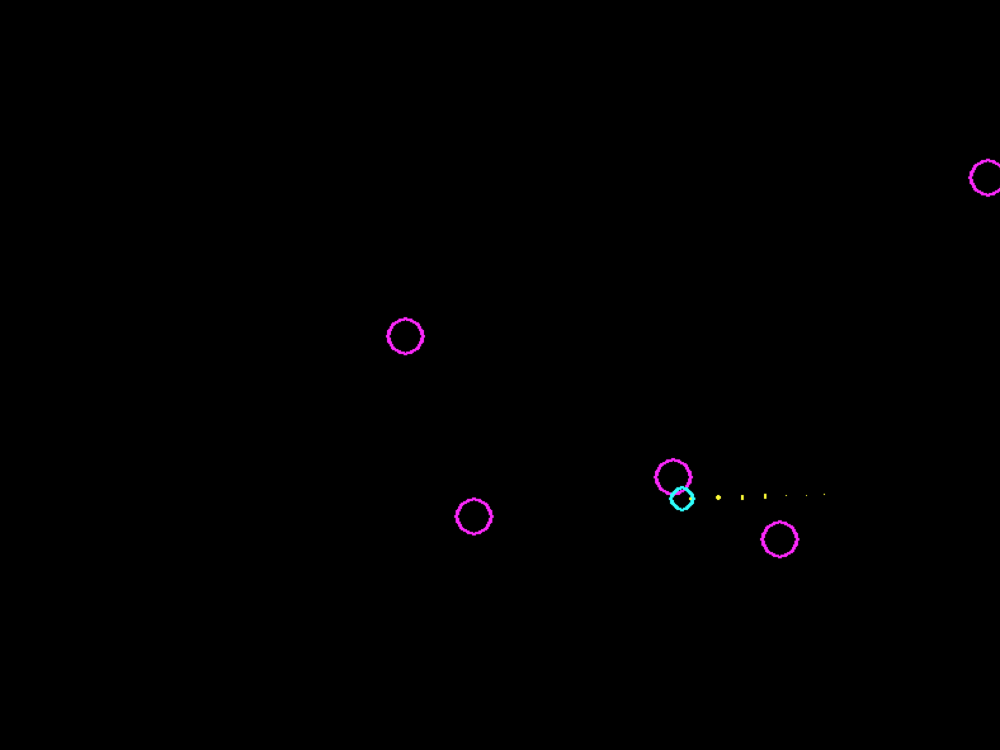

## Introduction

Source code of [A Talk Near the Future of Python (a.k.a., Dave live-codes a WebAssembly Interpreter)](https://www.youtube.com/watch?v=r-A78RgMhZU&t=1743s) by David Beazley

Note: I wrote this code while I was watching the video. I know it doesn't follow the PEP8 style guide, but that's not important for this project.

## Prerequisites

```bash
$ python3 -m pip install numpy
$ python3 -m pip install pygame
```

## Usage

```bash
$ python3 rocket.py
```

You will see something like below:


